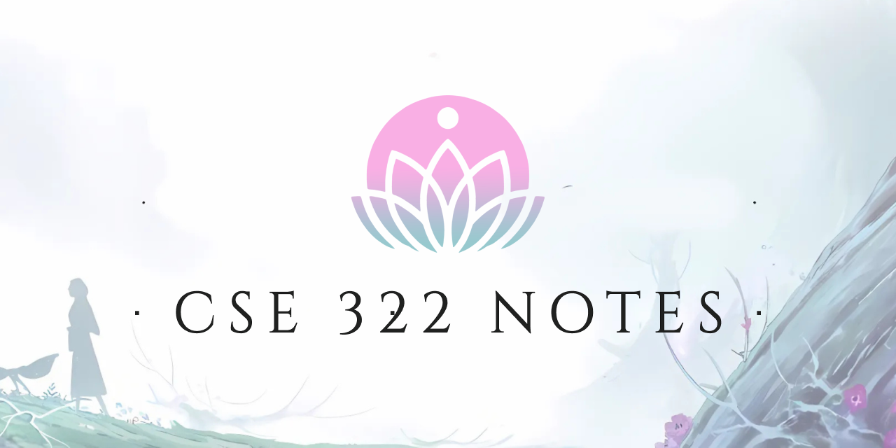

---

 

<blockquote style="text-align: center;">
    
    In twilight’s glow, the spirits rise,  
    Beneath the moon and painted skies.  
    Petals fall like whispered dreams,  
    Where life and death entwine in streams.  

    Ahri’s charm and Thresh’s chain,  
    Echoes of joy, sorrow, and pain.  
    A festival where souls unite,  
    In blossoms’ glow, eternal light.  

</blockquote>

 

# About the Project

**Spirit Blossom Notes** is a beautifully designed repository for CSE332 lecture notes, inspired by the enchanting Spirit Blossom theme. This project combines functionality with aesthetics, offering a visually appealing and organized way to access lecture materials.

### Features
- **Manually Curated Notes**: Links to lecture notes (PDFs) are organized for quick access.
- **Responsive Design**: The layout adapts seamlessly to different screen sizes.
- **Spirit Blossom Theme**: A unique and captivating design inspired by the Spirit Blossom festival.
- **Open Graph Support**: Optimized for social media sharing with a custom embed image.

### Technologies Used
- **HTML & CSS**: For structure and styling.
- **JavaScript**: For dynamic content rendering.
- **GitHub Pages**: For hosting and sharing the project.
- **CloudFlare**: For Custom domain

### How to Use
1. Visit the [ethics-notes](https://ethics-notes.pages.dev) or [Github Pages](https://d3faltxd.github.io/CSE332-Notes/) to access the notes.
2. Click on any lecture link to view or download the corresponding PDF.
3. Share the project link on social media to showcase the Spirit Blossom theme.
 

---
 

